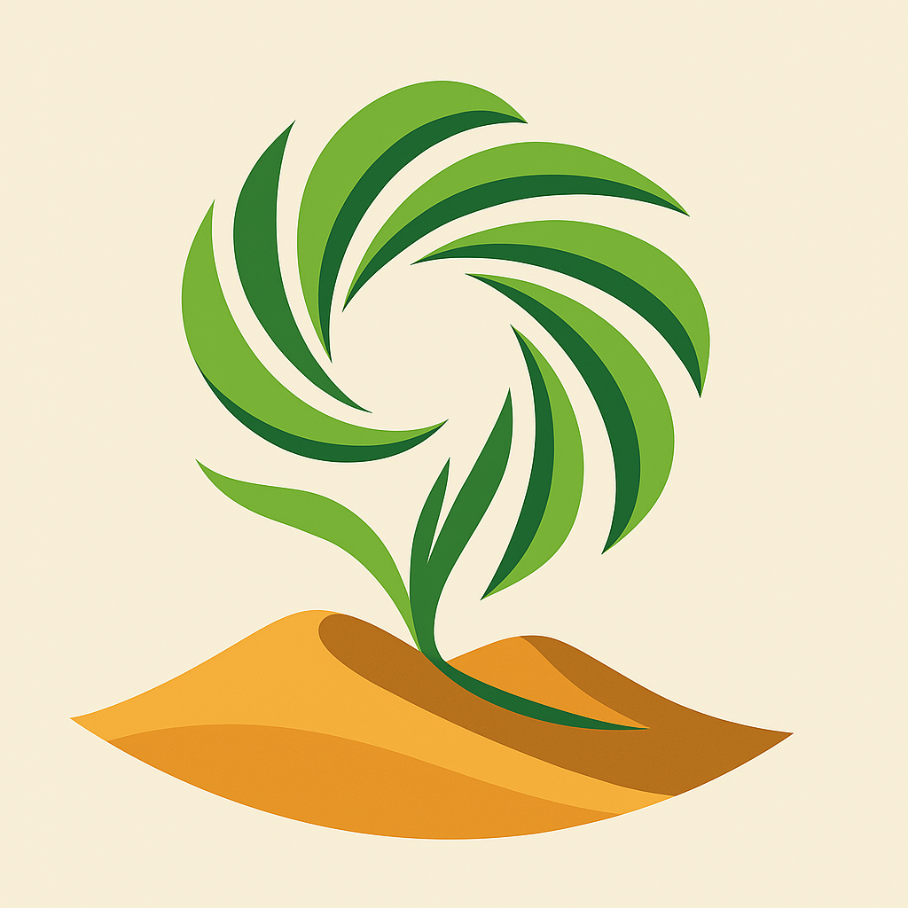

# DesertBloomAI V1.01 - Smart Desert Agriculture System

> **DesertBloomAI V1.01** is an intelligent, open-source platform for smart desert agriculture, combining robotics, IoT, and AI to enable sustainable and efficient farming in arid regions.

## Overview
DesertBloom AI is an intelligent system for managing and optimizing desert agriculture operations. It combines robotics, IoT sensors, and AI to create a sustainable and efficient farming environment in arid regions.

## Features

### Core Features
- Plant monitoring and management
- Smart irrigation system
- Environmental sensor network
- Data analytics and visualization
- Autonomous robotics control
- Path planning and navigation

### Path Planning
The system includes an advanced path planning module that enables:
- Autonomous robot navigation
- Obstacle avoidance
- Optimal path generation
- Path optimization for smooth movement
- Real-time collision detection
- Map visualization and management

## System Architecture

### Backend
- FastAPI-based REST API
- PostgreSQL database
- Redis for caching
- WebSocket for real-time updates
- Path planning service with A* algorithm
- Map data management

### Frontend
- Vue.js 3 web application
- Interactive map visualization
- Real-time monitoring dashboard
- Path planning interface
- Responsive design

### Robotics
- ROS-based robot control
- Path following and execution
- Sensor integration
- Autonomous navigation
- Charging station management

## Installation

### Prerequisites
- Python 3.8+
- Node.js 14+
- PostgreSQL 12+
- Redis 6+
- ROS Noetic (for robotics)

### Backend Setup
1. Create virtual environment:
```bash
python -m venv venv
source venv/bin/activate  # On Windows: venv\Scripts\activate
```

2. Install dependencies:
```bash
cd backend
pip install -r requirements.txt
```

3. Set up environment variables:
```bash
cp .env.example .env
# Edit .env with your configuration
```

4. Initialize database:
```bash
alembic upgrade head
```

5. Start the server:
```bash
uvicorn main:app --reload
```

### Frontend Setup
1. Install dependencies:
```bash
cd frontend
npm install
```

2. Set up environment variables:
```bash
cp .env.example .env
# Edit .env with your configuration
```

3. Start development server:
```bash
npm run serve
```

### Robotics Setup
1. Install ROS Noetic:
```bash
# Follow ROS installation instructions for your platform
```

2. Set up robot workspace:
```bash
cd robotics
catkin_make
source devel/setup.bash
```

3. Configure robot:
```bash
# Edit config/robot_config.json
# Edit config/map_data.json
```

4. Start robot nodes:
```bash
roslaunch desertbloom_ai robot.launch
```

## Usage

### Path Planning
1. Access the path planning interface at `/path-planning`
2. Select a robot from the dropdown
3. Enter start and goal positions
4. Click "Plan Path" to generate a path
5. Use "Optimize Path" to smooth the path
6. Toggle map layers to customize the view

### API Documentation
- Swagger UI: `http://localhost:8000/docs`
- ReDoc: `http://localhost:8000/redoc`

## Development

### Testing
```bash
# Backend tests
cd backend
pytest

# Frontend tests
cd frontend
npm run test:unit
```

### Code Style
```bash
# Backend
cd backend
black .
flake8 .

# Frontend
cd frontend
npm run lint --fix
```

## Contributing
1. Fork the repository
2. Create a feature branch
3. Commit your changes
4. Push to the branch
5. Create a Pull Request

## License
This project is licensed under the MIT License - see the LICENSE file for details.

## Acknowledgments
- FastAPI team for the excellent web framework
- Vue.js team for the progressive JavaScript framework
- ROS community for robotics tools and libraries
- All contributors and supporters of the project 